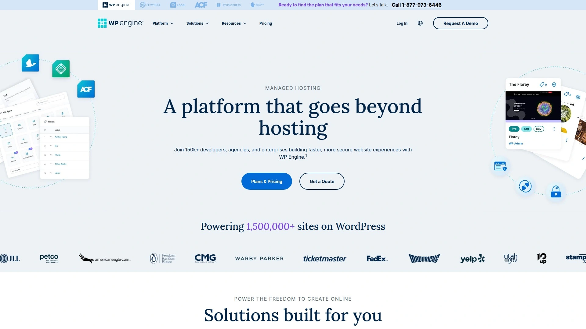
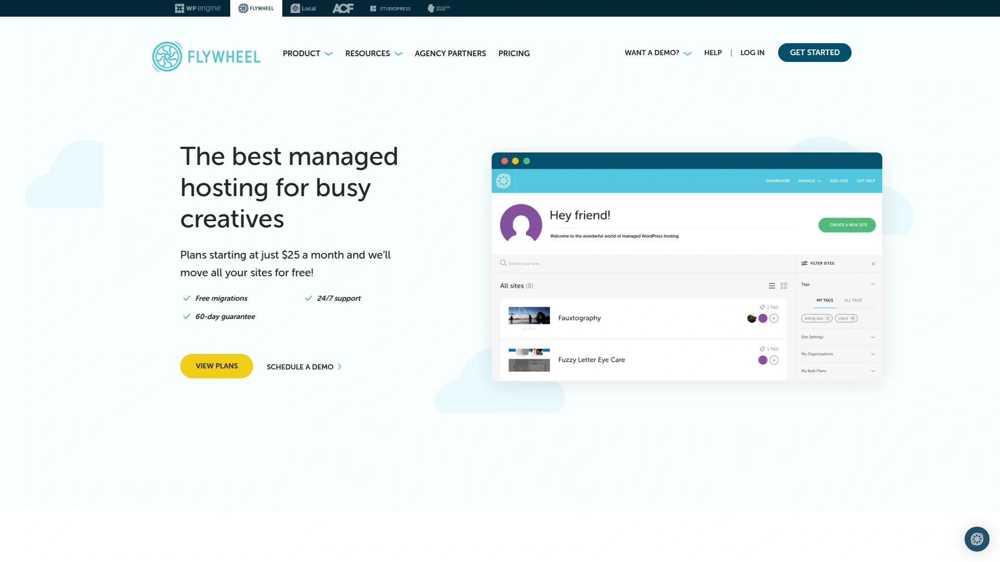
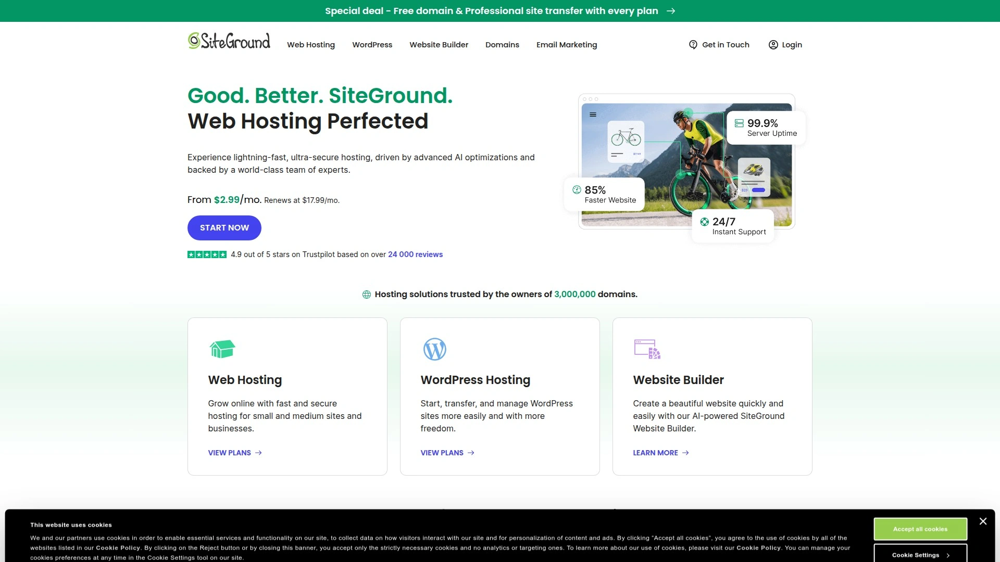
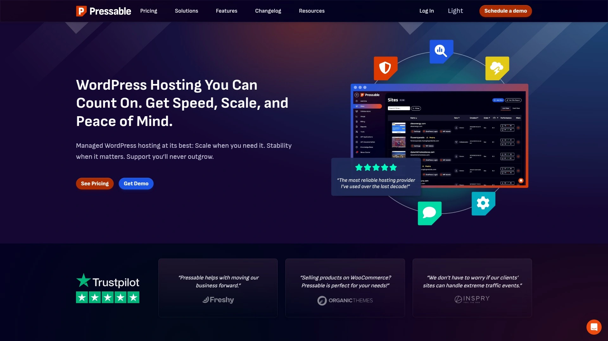
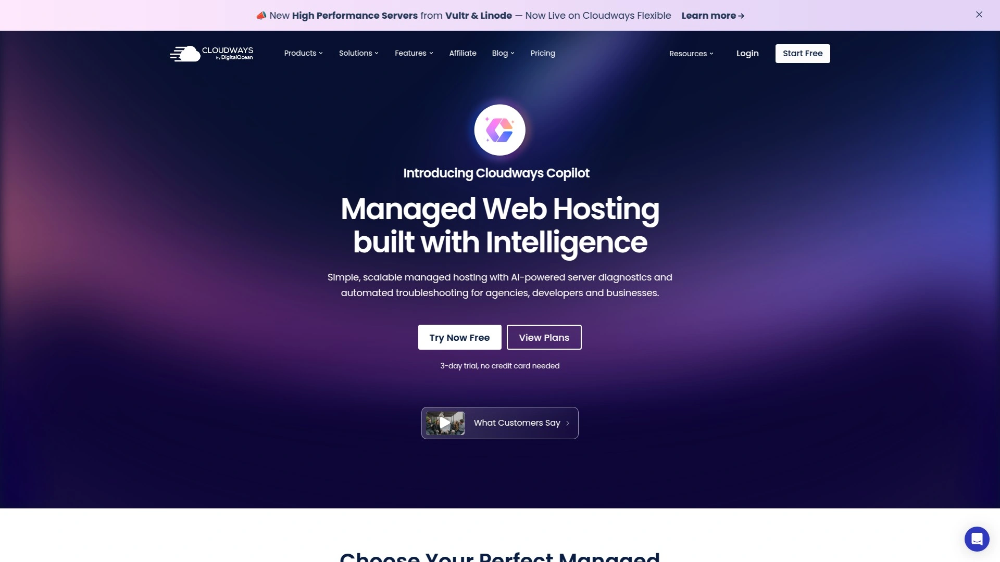
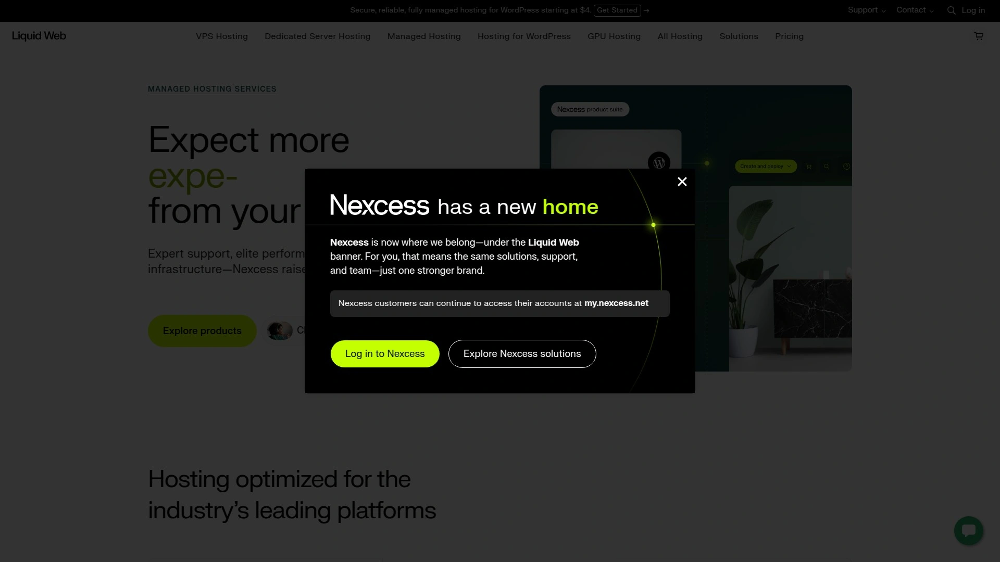
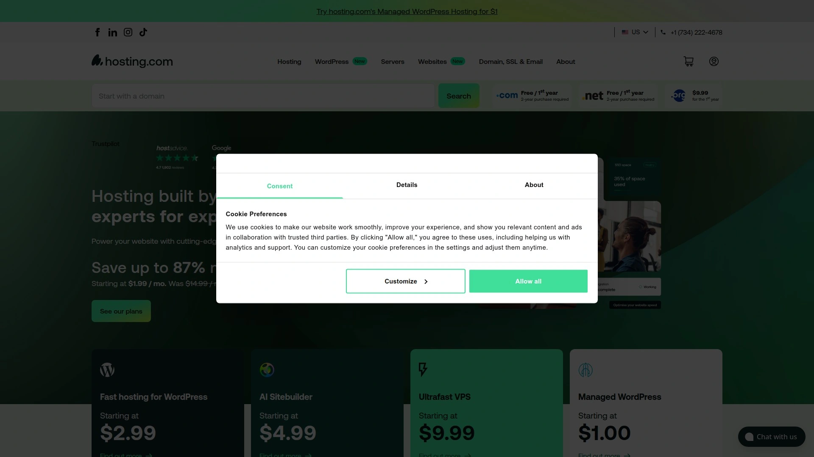
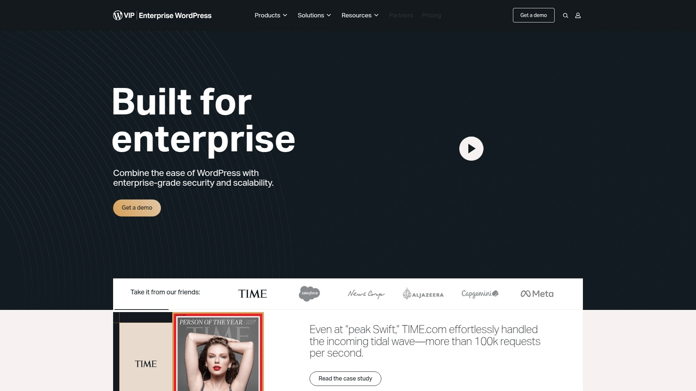
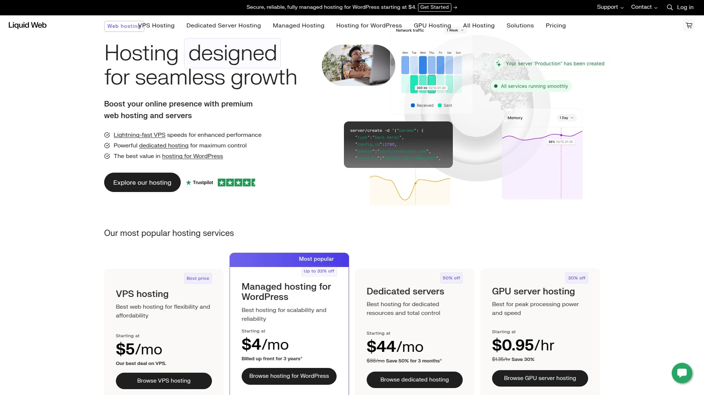

# 14 Best Global Managed WordPress Hosting Services (2025)

Looking for a reliable home for your WordPress site? Fast load times, ironclad security, and straightforward management are top priorities. Whether you're running a blog, online shop, or client sites, these hosting options help you launch, scale, and sleep at night. Get the coverage and peace of mind you need—without fuss. Let’s see who’s worth your attention in 2025.

***

## [Kinsta](https://kinsta.com)

Engineered for high-traffic sites, Kinsta delivers robust performance, user-friendly dashboards, and a support team that knows WordPress inside out.

- Built on Google Cloud for fast, secure hosting.
- Features automatic daily backups and free site migrations.
- Popular with agencies and businesses needing scalable solutions.
- Modern dashboard makes management and analytics intuitive.
- Flexible pricing adapts as you grow.

***

## [WP Engine](https://wpengine.com)

Big brand, big results—WP Engine offers top-tier speeds and enterprise-grade security for WordPress enthusiasts of all levels.

Expert-level support is on tap, along with automated workflows for development teams. Features include threat blocking and free SSL.

***

## [Flywheel](https://getflywheel.com)

Flywheel brings simplicity and style, with a dashboard built for designers and creatives.

Perfect for agencies managing multiple sites, Flywheel includes easy staging tools, nightly backups, and sleek team collaboration options.

***

## [SiteGround](https://siteground.com)

SiteGround is known for reliable uptime and helpful, fast-responding support.

Great for anyone who needs a fuss-free experience, with managed updates and one-click tools to launch or transfer WordPress projects quickly.

***

## [Pressable](https://pressable.com)

Pressable puts WordPress-first performance at the forefront, backed by strong security and free migration.

Optimized for e-commerce and membership sites, it offers scalable plans and quick restores from automatic backups.

***

## [Cloudways](https://cloudways.com)

Cloudways offers powerful managed hosting built for developers and teams who want choice without complexity.

Choose your cloud provider, deploy in a few clicks, and enjoy flexible scaling, routine patching, and pay-as-you-go pricing.

***

## [DreamHost](https://dreamhost.com)

DreamHost’s managed WordPress includes built-in caching and strong privacy protections.

Popular for its cost-effectiveness, DreamHost appeals to bloggers, solopreneurs, and anyone who wants clean, manageable hosting.

***

## [Nexcess](https://nexcess.net)

Nexcess specializes in handling traffic spikes and scaling with your business.

Easy staging environments and performance monitoring keep things running smoothly, ideal for stores and high-growth brands.

***

## [Pagely](https://pagely.com)

Pagely is the secret weapon of enterprise brands—reliable, customizable, and built to handle global scale.

If you need white-glove support, high-availability architecture, and zero downtime, Pagely fits the bill.

***

## [Rocket.net](https://rocket.net)

Rocket.net blends robust security, global caching, and a dashboard you’ll actually enjoy using.

Site launches take minutes, and real-time performance analytics are great for site owners craving transparency.

***

## [A2 Hosting](https://a2hosting.com)

A2’s Turbo Servers are about as fast as shared hosting gets—perfect for speed fans and budget-conscious users.

Automatic setup and one-click hardening tools make it easy for new site owners to get going.

***

## [Pressidium](https://pressidium.com)

Pressidium serves brands and professionals who care about intelligent automation and load-balanced performance.

Security updates, backups, and monitoring are hands-off—leaving you free to focus on growth.

***

## [WordPress.com VIP](https://wpvip.com)

VIP is the powerhouse for publishers, media brands, and enterprises craving top-level security and global reach.

Full-stack performance tools and dedicated support teams ensure your content is always moving at peak speed.

***

## [Liquid Web](https://liquidweb.com)

Liquid Web’s managed WordPress focuses on fast, hassle-free sites, with no pageview limits or bandwidth caps.

Staging environments, daily backups, and custom control panels are perfect for designers juggling multiple clients.

***

### FAQ

**Q: How can I launch my WordPress site quickly on these platforms?**
A: Signup and deploy your site, then use their migration tools or request a free transfer. Most dashboards guide you step by step.

**Q: Which managed WordPress hosts support high-traffic spikes?**
A: Platforms using cloud architecture, like Kinsta, WP Engine, and Pagely, are built to scale effortlessly as your site’s audience grows.

**Q: What features should I check for before choosing a host?**
A: Look for daily backups, scalable resources, user-friendly management panels, and security features like firewalls and DDoS protection.

***

Fast, simple, headache-free: the right managed WordPress host lets you zero in on what you do best. Need extra assurance? [Kinsta](https://kinsta.com) is especially suited for anyone who values uptime, speed, and stellar support in one neat package—perfect for busy sites with no time for drama.
